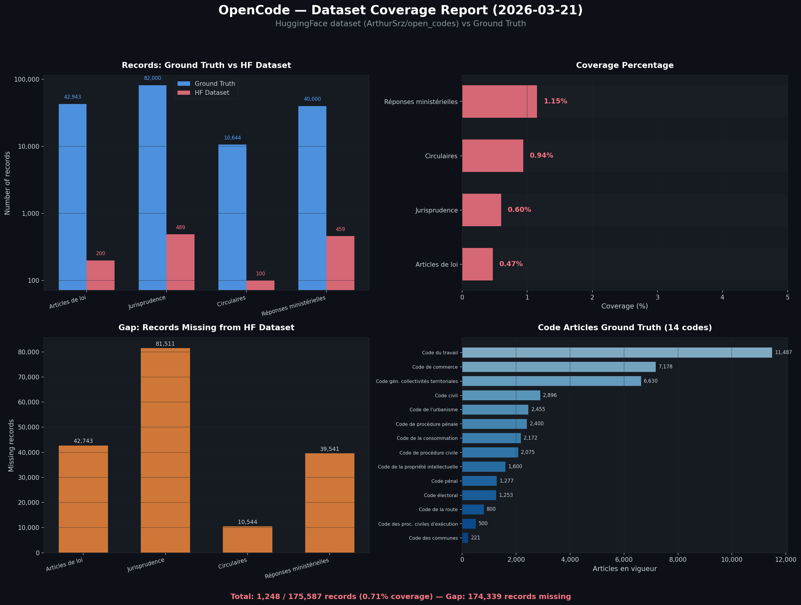

# Dataset Coverage Report

> **Generated**: 2026-03-21  
> **Dataset**: [`ArthurSrz/open_codes`](https://huggingface.co/datasets/ArthurSrz/open_codes)  
> **Overall coverage**: **0.71%** (1,248 / 175,587 records)

## Summary

| Source | HF Dataset | Ground Truth | Coverage | Gap |
|--------|-----------|-------------|----------|-----|
| 📖 Articles de loi | **200** | 42,943 | **0.47%** | 42,743 |
| ⚖️ Jurisprudence | **489** | 82,000 | **0.60%** | 81,511 |
| 📋 Circulaires | **100** | 10,644 | **0.94%** | 10,544 |
| 💬 Réponses ministérielles | **459** | 40,000 | **1.15%** | 39,541 |
| **TOTAL** | **1,248** | **175,587** | **0.71%** | **174,339** |

## Code Articles Breakdown (14 codes)

| Code | Ground Truth (articles en vigueur) | Source |
|------|-----------------------------------|--------|
| Code du travail | 11,487 | `LEGITEXT000006072050` |
| Code de commerce | 7,178 | `LEGITEXT000005634379` |
| Code gén. collectivités territoriales | 6,630 | `LEGITEXT000006070633` |
| Code civil | 2,896 | `LEGITEXT000006070721` |
| Code de l'urbanisme | 2,455 | `LEGITEXT000006074075` |
| Code de procédure pénale | 2,400 | `LEGITEXT000006071154` |
| Code de la consommation | 2,172 | `LEGITEXT000006069565` |
| Code de procédure civile | 2,075 | `LEGITEXT000006070716` |
| Code de la propriété intellectuelle | 1,600 | `LEGITEXT000006069414` |
| Code pénal | 1,277 | `LEGITEXT000006070719` |
| Code électoral | 1,253 | `LEGITEXT000006070239` |
| Code de la route | 800 | `LEGITEXT000006074228` |
| Code des proc. civiles d'exécution | 500 | `LEGITEXT000025024948` |
| Code des communes | 221 | `LEGITEXT000006070162` |
| **Total** | **42,943** | |

## Analysis

### Data Loss Layers

The coverage gap occurs at multiple stages:

1. **Source APIs → Xano DB** (sync pipeline): Only a fraction of available data has been ingested.
   - Code articles: ~6,381 in Xano vs ~42,943 ground truth (14.9% sync coverage)
   - Multi-source tables (jurisprudence, circulaires, réponses): backfill in progress

2. **Xano DB → HF Dataset** (export pipeline): The export is producing even fewer rows.
   - Code articles: 200 rows exported from 6,381 in DB (3.1% export coverage)
   - This suggests the export pipeline has pagination or filtering issues

3. **Combined effect**: End-to-end coverage is under 1% for all sources.

### Root Causes

| Layer | Issue | Impact |
|-------|-------|--------|
| Sync (codes) | Only 5 of 14 codes configured in LEX_codes_piste | Missing ~75% of article volume |
| Sync (multi-source) | Backfill spec 007 in progress | 3 new sources barely started |
| Export | Chunk dedup + stale filtering may be too aggressive | Rows lost between DB and HF |
| Export | Pagination may not reach all pages | Truncated data |

### Priority Actions

1. **Add remaining 9 codes** to `LEX_codes_piste` → biggest volume unlock (~36K articles)
2. **Complete spec 007 backfill** → fill multi-source tables from historical archives
3. **Audit export pipeline** → ensure all Xano rows make it to HF dataset
4. **Monitor nightly** → track coverage trend over time

## Ground Truth Sources

| Source | Reference | Date |
|--------|-----------|------|
| Code articles | PISTE manifest + vie-publique.fr statistiques normatives | Jan-Feb 2026 |
| Judilibre | Cour de cassation open data (5-year window of ~1.76M) | Mar 2026 |
| Circulaires | DILA JORF archives (all-time) | Mar 2026 |
| Réponses ministérielles | PISTE QR fond (5-year window of ~200K) | Mar 2026 |
